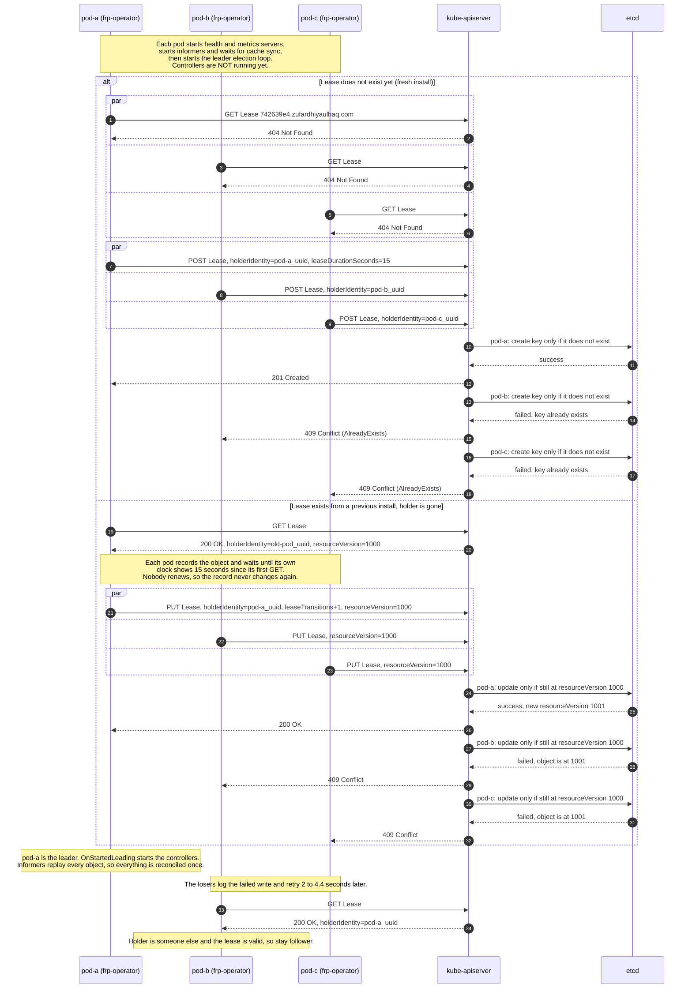
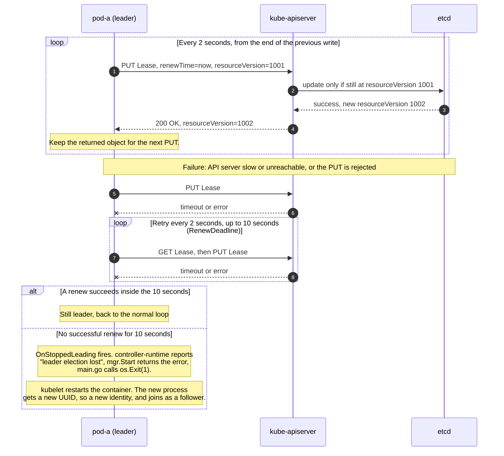
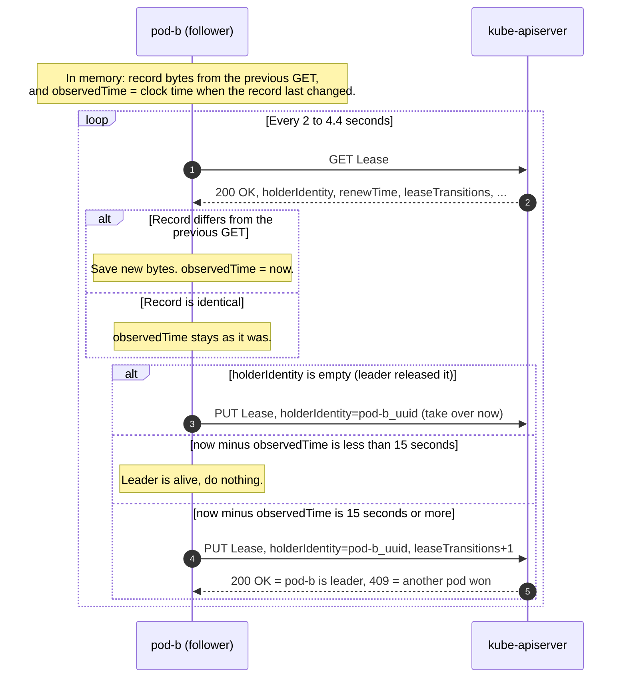
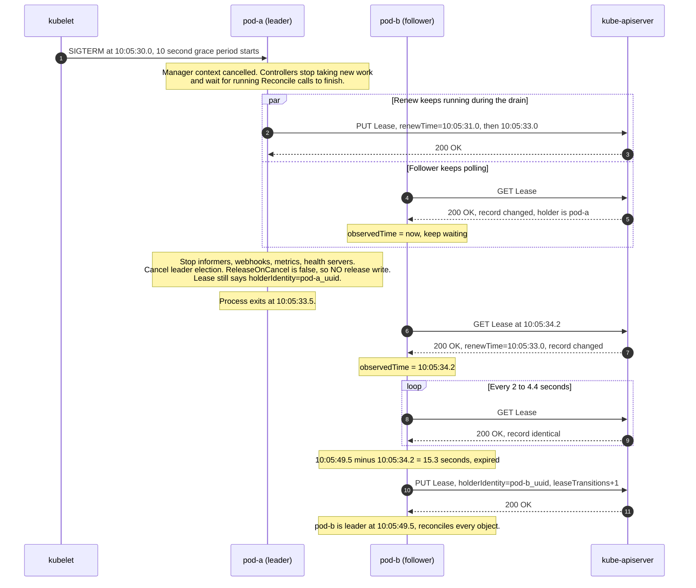
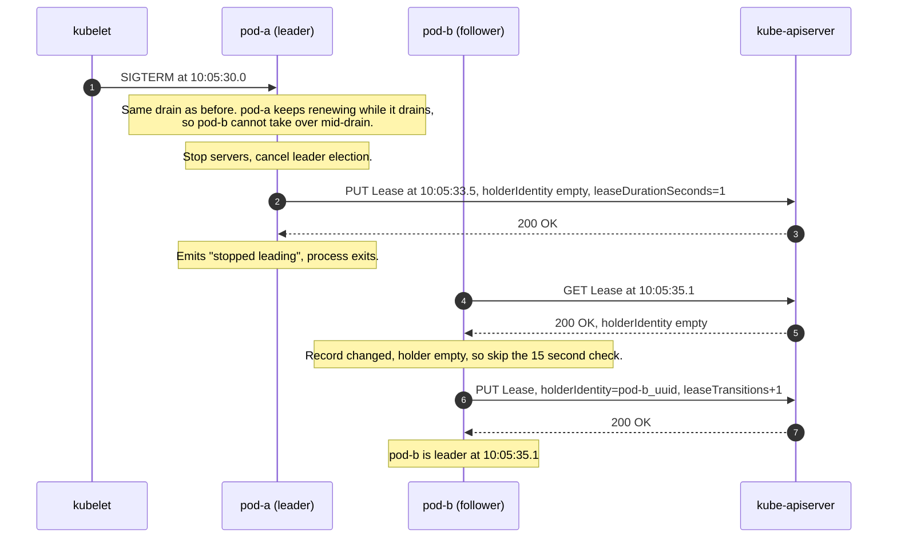
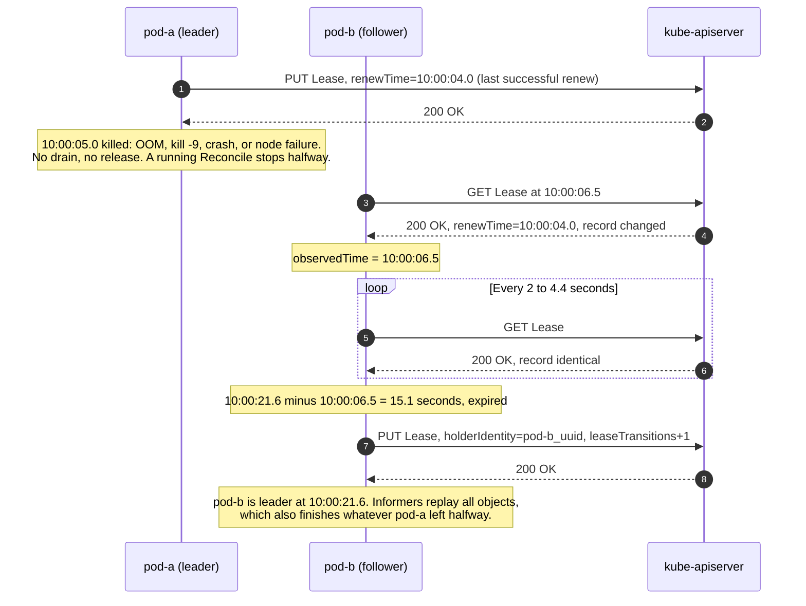
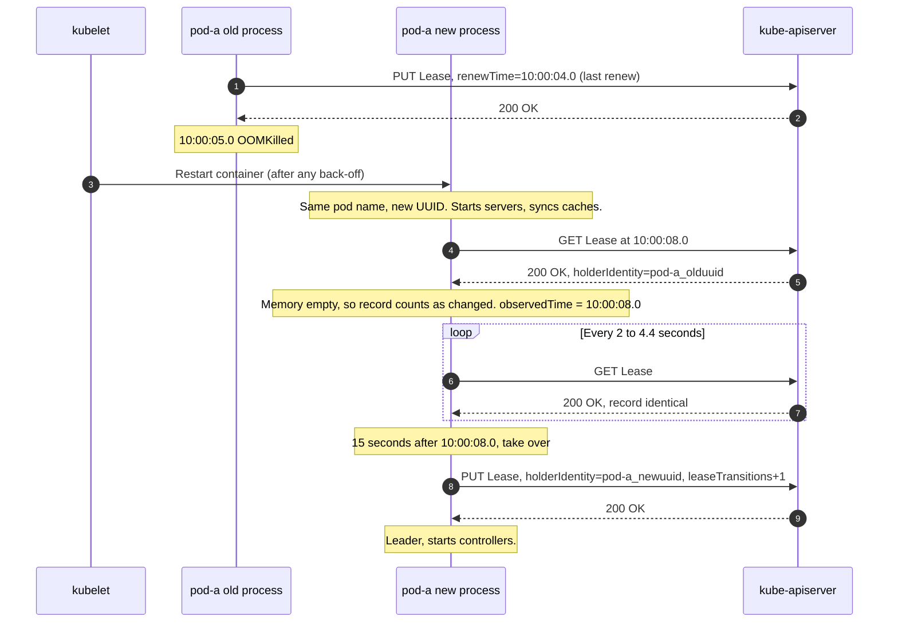

I write Kubernetes operator like [frp-operator](https://github.com/zufardhiyaulhaq/frp-operator) and istio-ratelimit-operator, maintain multiple Kubernetes operator like ArgoCD, Istio, CloudNativePG, etc. but never actually understand how this controller handle leader election.

Leader election is needed since controller cannot run in High Availability mode, they will try to reconcile the same objects. causing race condition. Leader election is how Kubernetes lets you run several replicas but keep exactly one of them doing the work. 

In this blog, I will deepdive into how leader election works in Kubernetes. The mechanism is smaller than it looks: one `Lease` object and the API server's optimistic concurrency. No consensus algorithm, no quorum, no gossip.

I will use my own operator, [frp-operator](https://github.com/zufardhiyaulhaq/frp-operator), as the running example so the numbers are real. It runs on controller-runtime v0.18.4 and client-go v0.30.1 with the library defaults.

## The Lease object

Leader election is backed by a single `Lease` in the `coordination.k8s.io/v1` API, one per operator. Its fields are the whole state machine: 
1. `holderIdentity` (who holds it)
2. `leaseDurationSeconds` (how long it is valid without a renew)
3. `renewTime`
4. `acquireTime`
5. `leaseTransitions` (a counter of handovers of leader).

```yaml
apiVersion: coordination.k8s.io/v1
kind: Lease
metadata:
  name: 742639e4.zufardhiyaulhaq.com
  namespace: infrastructure
spec:
  acquireTime: "2026-09-19T05:23:47.524381Z"
  holderIdentity: frp-operator-controller-manager-846c7b98bc-gnmc2_0e7f0f68-c485-4a86-93f6-ed79fc59edcf
  leaseDurationSeconds: 15
  leaseTransitions: 298
  renewTime: "2026-09-19T05:24:47.095340Z"
```

The values frp-operator runs with, all library defaults unless noted:

| Setting | Value | Source |
|---|---|---|
| Lock object | `Lease` | controller-runtime default |
| Lease name | `742639e4.zufardhiyaulhaq.com` | `LeaderElectionID` in `main.go` |
| Identity of each pod | `<pod name>_<random UUID>`, new UUID every process start | controller-runtime |
| LeaseDuration | 15 seconds | default |
| RenewDeadline | 10 seconds | default |
| RetryPeriod | 2 seconds | default |
| Follower poll interval | 2 to 4.4 seconds (RetryPeriod plus random 0 to 2.4) | client-go jitter |
| LeaderElectionReleaseOnCancel | false | default |

## Electing the first leader

Controllers do not run until a pod wins. Every pod first starts its health and metrics servers and waits for its informer caches to sync, and only then enters the election loop.

The API server does not pick the winner by itself. It passes every write to etcd as a conditional transaction: a create succeeds only if the key does not exist, an update succeeds only if the object is still at the `resourceVersion` the client sent. So exactly one request wins and the rest get `409 Conflict`.



On a fresh install the winner gets `201 Created` and the losers get `409` with reason `AlreadyExists`. When a stale Lease already exists, the winner of the conditional `PUT` gets `200 OK` and the losers get `409 Conflict`. Either way, one writer wins on a single etcd transaction. No election protocol runs between the pods at all.

## Holding the lease

The leader keeps the lease by writing `renewTime` every `RetryPeriod` (2 seconds), counted from the end of the previous write. It reuses the Lease object it got back from its last write, so it does not even need a `GET` first.



The important number is `RenewDeadline` (10 seconds). If the leader cannot renew for that long, it does not keep acting as leader; it deliberately exits. That leaves room before any follower is allowed to take over:

| Time | Event |
|---|---|
| 10:00:00.0 | Last successful renew |
| 10:00:02.0 | Next renew fails, the 10 second RenewDeadline starts |
| 10:00:12.0 | Leader gives up and exits |
| 10:00:15.0 | Earliest a follower can consider the lease expired |

The leader always stops at least 3 seconds before any follower can take over. That gap (RenewDeadline shorter than LeaseDuration) is what prevents two active leaders.

## How a follower spots a dead leader

This is the part that surprises people. **A follower never reads `renewTime` as a timestamp. It only checks whether the Lease record changed.**

Each follower keeps two things in memory: the bytes of the record from its last `GET`, and `observedTime`, which is the time on the follower's own clock when it last saw the record change. If the record has not changed for `LeaseDuration` (15 seconds) by the follower's own clock, the lease is expired and the follower tries to take it.



Why compare bytes instead of trusting `renewTime`? Because `renewTime` is written by the leader's clock and read by the follower's clock, and those two clocks are on different nodes. Comparing them directly would make expiry depend on clock skew. Comparing the record against its own previous copy, and timing with its own clock, keeps the whole decision local.

A worked example, leader renewing at `:00`, `:02`, `:04` and then dying:

| Follower poll | Record changed? | observedTime | now minus observedTime | Expired? |
|---|---|---|---|---|
| 10:00:06.5 | yes | 10:00:06.5 | 0.0 s | no |
| 10:00:09.8 | no | 10:00:06.5 | 3.3 s | no |
| 10:00:13.2 | no | 10:00:06.5 | 6.7 s | no |
| 10:00:16.9 | no | 10:00:06.5 | 10.4 s | no |
| 10:00:19.5 | no | 10:00:06.5 | 13.0 s | no |
| 10:00:21.6 | no | 10:00:06.5 | 15.1 s | yes, take over |

## Losing the leader: graceful shutdown

A `SIGTERM` is the common case: `kubectl delete pod`, a rollout restart, a Helm upgrade, a node drain. By default (frp-operator does not set `LeaderElectionReleaseOnCancel`) the leaving leader does **not** clear the Lease. It just stops renewing, and the record sits with the old holder until it expires.



In this example no controller runs from 10:05:30.0 to 10:05:49.5, about **19.5 seconds**, even though the shutdown itself was clean. The gap is almost a full `LeaseDuration`, spent waiting for a lease everyone knows is dead.

## Faster handoff: release on cancel

Setting `LeaderElectionReleaseOnCancel: true` in `ctrl.Options` changes one thing: on shutdown the leader writes the Lease one last time with an empty `holderIdentity`. A follower that sees an empty holder skips the 15 second wait entirely and takes over on its next poll.



The pause drops from about 19.5 seconds to about **5.1 seconds**, most of which is the drain itself. The release is best-effort: it falls back to the default behavior if the final `PUT` hits a `409`, if the leader had already lost the lease, or if the drain runs past the 10 second grace period and kubelet sends `SIGKILL`.

## Losing the leader: hard kill

`SIGKILL`, an OOM kill, a crash, or a node failure gives no chance to drain and no chance to release. The Lease simply stops changing, and the follower waits it out exactly like the graceful-without-release case.



No controller runs from 10:00:05.0 to 10:00:21.6, about **16.6 seconds**, and the takeover can land up to 4.4 seconds later depending on when the follower happens to poll.

## The single-replica trap

The chart default is 1 replica, so most of the time there is no follower waiting. When the one pod dies, the same container name comes back, but with a **new UUID**, so a new identity, and with empty memory. Because its memory starts empty, it has to wait the full 15 seconds from its own first `GET`, no matter how long the old process has been dead.



## Tuning and takeaways

- Shorter `LeaseDuration` and `RenewDeadline` mean faster failover but more writes and problem for a slow API server. The defaults (15 / 10 / 2) are a sane starting point.
- Set `LeaderElectionReleaseOnCancel: true` if you care about fast, clean handovers on rollouts. It turns a ~15 second wait into an immediate takeover, for the cost of one extra write to API server.
- Run at least 2 replicas for real availability, and add pod anti-affinity so they do not share a node or a failure domain.
- `leaseTransitions` is a health signal. If it climbs, your leader is flapping and never stable.

## Sources

- Kubernetes docs: [Leases](https://kubernetes.io/docs/concepts/architecture/leases/) and the [Lease API reference](https://kubernetes.io/docs/reference/kubernetes-api/coordination/lease-v1/).
- client-go v0.30.1: [`tools/leaderelection/leaderelection.go`](https://github.com/kubernetes/client-go/blob/v0.30.1/tools/leaderelection/leaderelection.go) (`acquire`, `renew`, `release`, `tryAcquireOrRenew`, `isLeaseValid`) and [`resourcelock/leaselock.go`](https://github.com/kubernetes/client-go/blob/v0.30.1/tools/leaderelection/resourcelock/leaselock.go).
- controller-runtime v0.18.4: [`pkg/leaderelection/leader_election.go`](https://github.com/kubernetes-sigs/controller-runtime/blob/v0.18.4/pkg/leaderelection/leader_election.go) and [`pkg/manager/internal.go`](https://github.com/kubernetes-sigs/controller-runtime/blob/v0.18.4/pkg/manager/internal.go).
- frp-operator: [`main.go`](https://github.com/zufardhiyaulhaq/frp-operator/blob/main/main.go) and the [Helm chart](https://github.com/zufardhiyaulhaq/frp-operator/blob/main/charts/frp-operator/templates/deployment.yaml).
